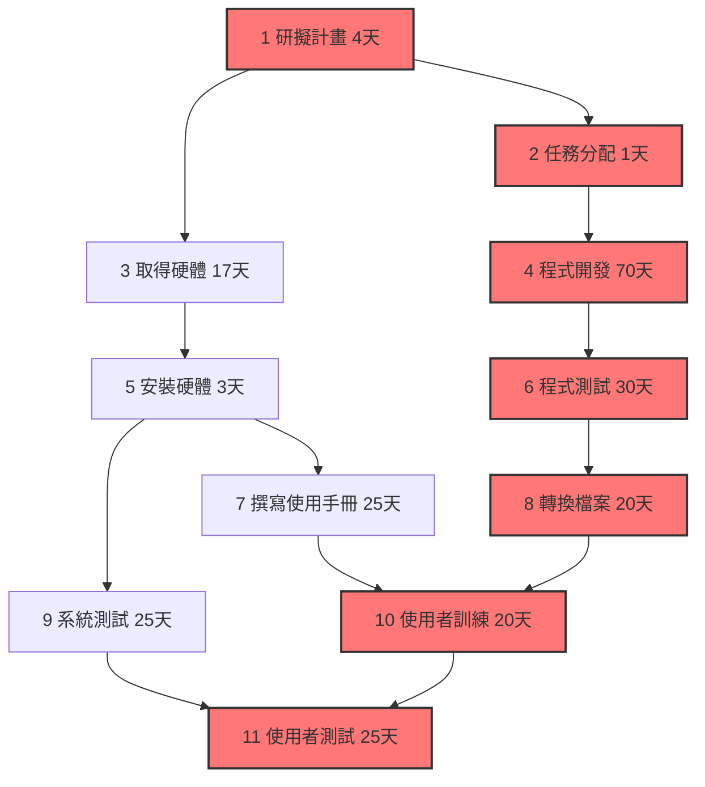
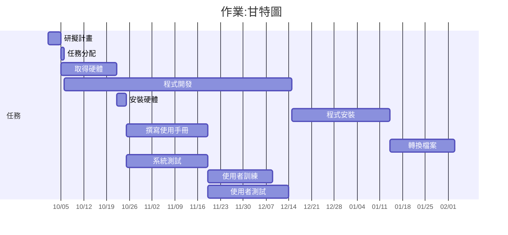

# 作業 2 - PERT/CPM、甘特圖與關鍵路徑

## 1. PERT/CPM 圖

```mermaid
graph TD
    A1[1 研擬計畫 4天] --> A2[2 任務分配 1天]
    A1 --> A3[3 取得硬體 17天]
    A2 --> A4[4 程式開發 70天]
    A3 --> A5[5 安裝硬體 3天]
    A4 --> A6[6 程式測試 30天]
    A5 --> A7[7 撰寫使用手冊 25天]
    A6 --> A8[8 轉換檔案 20天]
    A5 --> A9[9 系統測試 25天]
    A7 --> A10[10 使用者訓練 20天]
    A8 --> A10
    A9 --> A11[11 使用者測試 25天]
    A10 --> A11

    classDef critical fill:#f77,stroke:#333,stroke-width:2px;
    class A1,A2,A4,A6,A8,A10,A11 critical;


```
## 2. 甘特圖

```mermaid


gantt
title 作業:甘特圖
dateformat YYYY-MM-DD
axisFormat %m/%d

section 任務
研擬計畫 :a1, 2025-10-01, 4d
任務分配 :a2, after a1, 1d
取得硬體 :a3, after a1, 17d
程式開發 :a4, after a2, 70d
安裝硬體 :a5, after a3, 3d
程式安裝 :a6, after a4, 30d
撰寫使用手冊 :a7, after a5, 25d
轉換檔案 :a8, after a6, 20d
系統測試 :a9, after a5, 25d
使用者訓練 :a10, after a7, 20d
使用者測試 :a11, after a9, 25d

``` 
