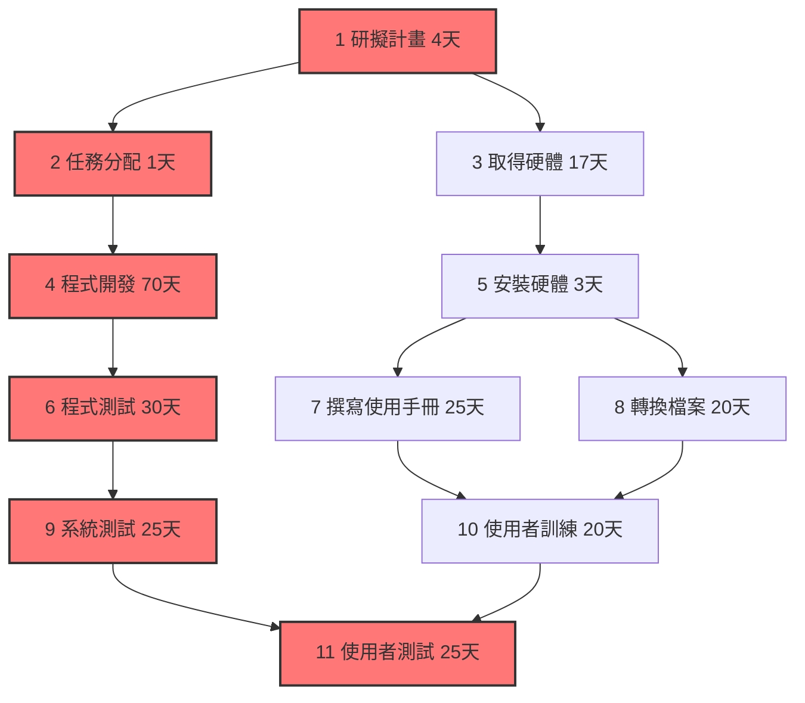
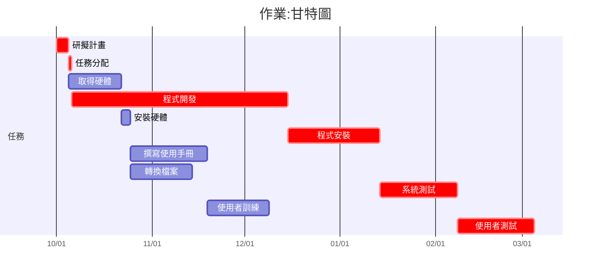

# HW2 專案管理作業

## 1. 任務分解與工期估算 (WBS)

| 任務編號 | 任務名稱           | 工期 (天) |
|----------|--------------------|-----------|
| 1        | 第一階段功能整合測試 | 7         |
| 2        | 第二階段功能構想     | 5         |
| 3        | 工作分配             | 1         |
| 4        | 撰寫程式碼           | 30        |
| 5        | 功能測試             | 1         |
| 6        | Debug 與優化         | 21        |
| 7        | 第二階段功能整合測試 | 7         |
| 8        | 撰寫文件與教學整理   | 10        |

---

## 2. 甘特圖

